# A semi-automated workflow paradigm for the distributed creation and curation of expert annotations
{:.no_toc}

* This will become a table of contents (this text will be scraped).
{:toc}

# Introduction

This page introduces a concrete implementation of the annotation workflow paradigm
proposed by Johannes Hentschel, Fabian Moss, Markus Neuwirth, and Martin Rohrmeier
at the ISMIR conference 2021. It makes use of
[GitHub Actions](https://github.com/features/actions) and can be easily adopted
through the corresponding [template repository](https://github.com/DCMLab/annotation_workflow_template/tree/ismir2021).
It is an adapted version of the implementation that is at the heart of the
[DCML Corpus Initiative](https://www.epfl.ch/labs/dcml/projects/corpus-project/)
and, without further configuration, works out of the box for public repositories
only.

## General use Case

The implementation is designed for a distributed setting where one or several
annotators create text-based annotations in Git repositories hosted on
[github.com](https://github.com), where their history is kept including all
discussions occurring during their review. The following schema shows one cycle
of the workflow, at the end of which a reviewed annotation file is merged
into the main branch, reflecting a consensus between the annotator and the
reviewer, as laid out in our conference paper:

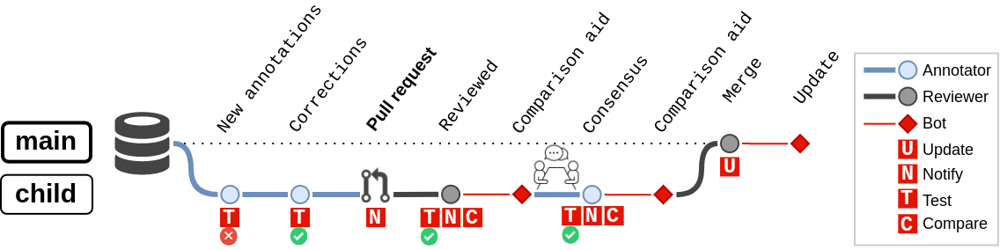

The workflow currently consists of four different automatic actions, represented
as red squares in the schema, that are triggered by particular events:

* `Test` is triggered upon every push to a child branch and checks the annotations
  in all modified files for syntactical correctness. The schema exemplifies how
  this action detects at least one syntax error in the commit `New annotations`,
  causing the annotator to push `Corrections` which pass the renewed test.
* `Compare` is triggered upon every push to a child branch after a pull request
  has been created. For every new version pushed during the deliberation between
  annotator and reviewer(s), this action, through a bot account, pushes auxiliary
  files that allow to keep an easy overview of the suggested changes. This can
  be particularly helpful in use cases where the annotations need to be seen
  in relation to the original data that they describe in order to discuss them.
* `Update` is triggered upon merge of the reviewed annotations into the `main`
  branch and, again, uses a bot account to

  * include information about the completed annotations in overviews, for
    instance names of annotators and reviewers, amount of annotations, version
    of the annotation standard, applied tools, etc.
  * create summary statistics and plots for the new annotations
  * convert the new annotations to different formats, perform transformations, etc.

* The fourth action, `Notify`, stands for notifications that GitHub dispatches
  to the contributors according to their preference settings, to inform them
  about particular events to which they might have to react, such as a new
  version with changes to be discussed.

## Specific use case

The implementation that users can use out of the box is tailored to
the specific setting where annotators make use of the free and open-source
notation software [MuseScore 3](https://musescore.org/) to enter annotations
into scores. In principle, it can be used for whatever annotations you may
want to enter (see section [annotate files](#annotate-files)), but by default
it is specifically configured to test all entered labels for compliance with the
[DCML harmony annotation standard](https://github.com/DCMLab/standards)
which follows a particular syntax to encode harmony, phrase, and cadence
annotations.

In order to perform automated tasks on annotated MSCX (uncompressed MuseScore format)
files, this workflow implementation uses commands provided by the parsing library
[ms3](https://pypi.org/project/ms3/). The mapping of the three actions mentioned
above to commands of this library is:

* `Update => ms3 extract` to extract and store information from the annotated MSCX files
  in the form of tab-separated values (TSV) files, namely by default:

  * annotations
  * notes
  * measures
  * metadata

* `Test => ms3 check` to detect syntax errors in the annotated MSCX files
* `Compare => ms3 compare` to store, after a review of annotations, a copy of each
  reviewed MSCX file in which the reviewer's changes are colour-highlighted.

**If you are using other annotation standards, you may want to**

* substitute code for `ms3 check` accordingly, to test your annotations' validity;
* prevent `ms3 extract` from trying to split the annotation labels into the
  various features encoded through the DCML standard (see at the end of the
  section [ms3 extract](#ms3-extract) below).

## How to use the workflow implementation

This is a quick reference how the implementation can be used out of the box.
A more detailed explanation for annotators and reviewers that also includes
specific Git commands is part of the
[DCML annotation standard's documentation](https://dcmlab.github.io/standards/workflow).
The [documentation below](#documentation) aims at users who would like to
adapt the GitHub workflow files to their particular use case.

### Create a GitHub repository

1. Head to the [template repository](https://github.com/DCMLab/annotation_workflow_template/tree/ismir2021)
   and click on "Use this template".\
   
1. Create the new repository (if you want it "Private", you need to reconfigure
   the bot, see [below](#configuring-the-workflow-for-private-repositories)).\
   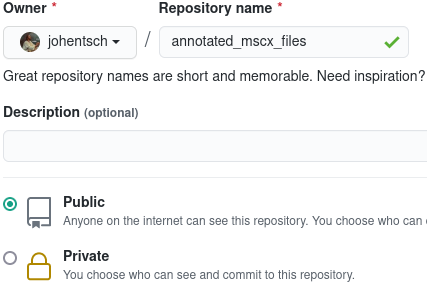
1. In the new repo, click on "Code" to copy the URL for the `git clone` command
   and clone the repo to your machine (`git clone git@github.com:johentsch/annotated_mscx_files.git`
   in the example here).\
   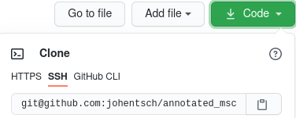

### Add uncompressed MuseScore files

1. Create a subfolder (here called `MS3`), add the MSCX (uncompressed MuseScore
   format) files to it, and push everything to GitHub. During the following
   minute, the yellow circle indicates that the `ms3_extract` Action is running.\
   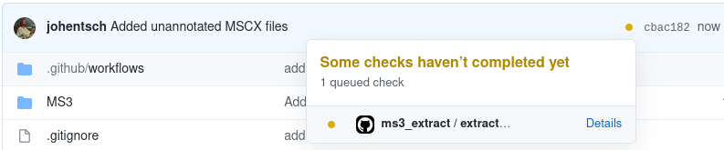
1. Refresh the page until the yellow circle becomes a green check. You will
   see that the `github-actions` bot pushed a commit creating the folders
   `measures` and `notes` as well as the files `README.md` and `metadata.tsv`.\
   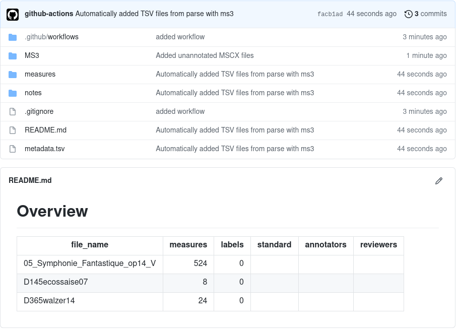

These files are automatically updated every time an MSCX file is modified on the
main branch. Exactly what information is extracted and stored under which
directory can be configured to your needs (see the section
[ms3 extract](#ms3-extract) below).

You can add custom text to the README.md as long
as you do it above the 'Overview' heading. Everything below this heading is
automatically overwritten.

### Annotate files

1. Create a new branch and use MuseScore 3 to add annotation labels to one of the
   harmony layers (`Add -> Text -> {Chord Symbol|Roman Numeral Analysis|Nashville Number}`).
   For example, take this annotated _Ecossaise No. 7_, D. 145 by Franz Schubert
   that uses the Roman Numeral Analysis layer and the DCML syntax:\
   
1. Commit the changes. Every time you push to a child branch, the labels in
   all changed files will be checked for syntactical correctness according to
   the [DCML harmony annotation standard](https://github.com/DCMLab/standards):\
   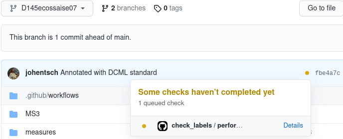
1. If the yellow circle turns into a red cross, at least one syntax error was
   found and by clicking on it you can have it displayed. In this example, the
   output shows one wrong label in measure 8, onset 1/4 (beat 2), because
   the `}` indicating the phrase ending needs to be the last character:\
   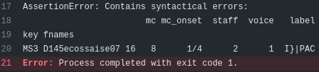
1. Once the error is fixed, the new annotations can be merged into the main
   branch by opening a pull request:\
   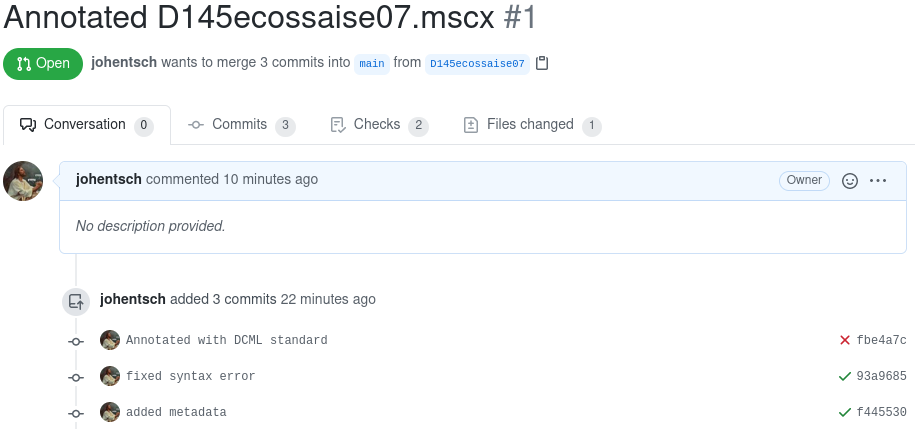
1. After merging the pull request, the `ms3_extract` action is triggered again
   which will

  * extract a tabular overview of the labels and store it as `harmonies/[file name].tsv`:\
    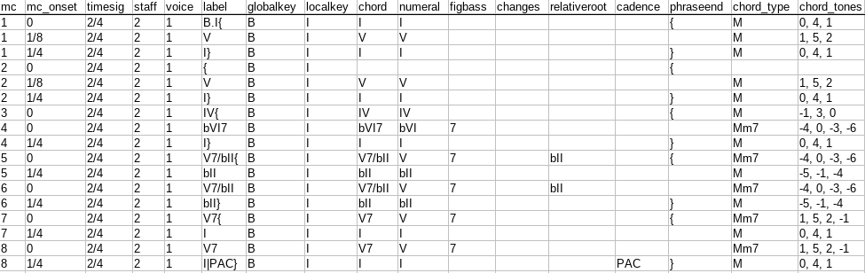
  * read out the metadata from the updated MuseScore file which had been modified
    in MuseScore by the annotator like so:\
    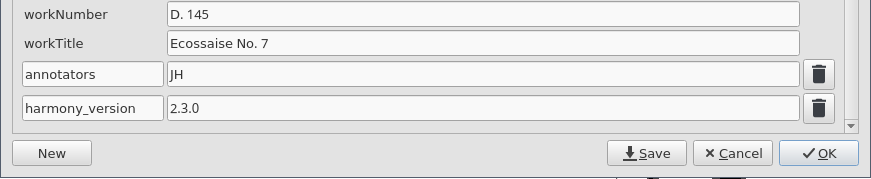
  * and writes these metadata to `metadata.tsv` and to the overview in the README file:\
    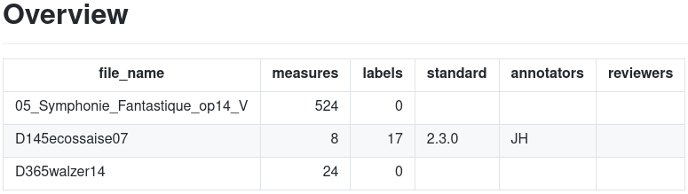

Our [Annotation Tutorial](https://dcmlab.github.io/standards/build/html/tutorial/musescore.html#placing-the-annotation-cursor)
has some more explanations on how to conveniently add Roman Numerals in MuseScore 3.

**If you are using other annotation standards, you may want to**

* substitute code for `ms3 check` accordingly, to test your annotations' validity;
* prevent `ms3 extract` from trying to split the annotation labels into the
  various features encoded through the DCML standard (see at the end of the
  section [ms3 extract](#ms3-extract) below).

### Review files

1. The reviewer checks out a child branch and commits their changes to the
   annotated MuseScore file, which includes adding their initials to the file's
   metadata so that they will appear in the README upon merge into main.
1. Then, the reviewer creates a pull request to suggest the changes to
   the annotator who is supposed to go through them to approve or contest them:\
   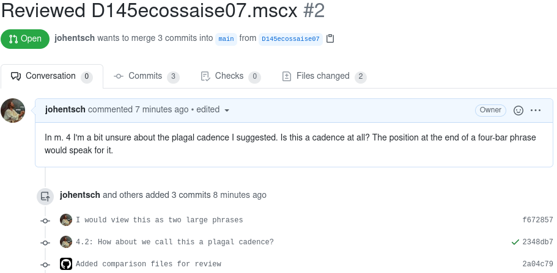\
   This time, because of the presence of the `harmonies/[file name].tsv`
   file, the `label_comparison` results in the `github-actions` bot pushing
   an auxiliary MSCX file highlighting the changes made by the reviewer:\
   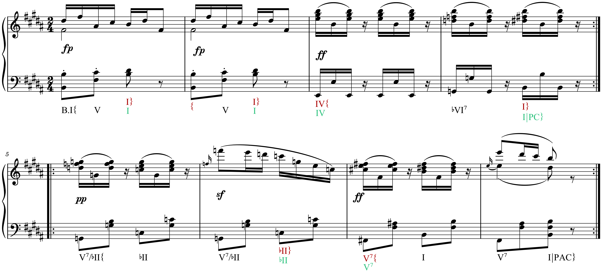
1. After merging the pull request, the README shows that one file is done and
   two others are yet to do:\
   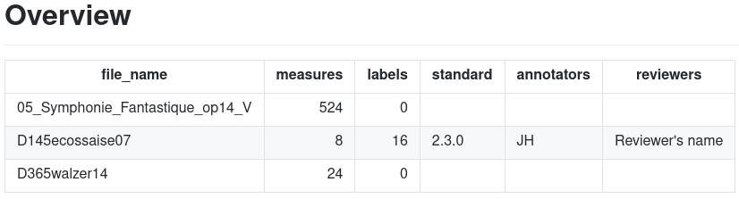

# Documentation

In the following we cover what you need to know to adapt the implementation
to your own needs. As described in the conference paper, it is organized
around three different tasks, each defined in its own YAML file stored in
the (hidden) folder `.github/workflows`:

* `extract.yml` (Update), triggered upon every push to the `main` branch;
* `check.yml` (Test), triggered upon every push to a child branch (not on `main`);
* `compare.yml` (Compare), triggered upon pull request and new commits added to it.

The following sections explain the structure of these files to give an idea
how they can be adapted to other projects' needs. Projects using annotated
MuseScore files, too, might want to keep using the MuseScore parsing library
[ms3](https://pypi.org/project/ms3/) and adapt the employed commands. For
dealing with other annotation data, users will have to replace the library with other
code.

## Structure of the YAML files

On the top level, each configuration file has three directives:

    name:   # arbitrary name of the action
    on:     # definition when the action is triggered
    jobs:   # definition of one or several jobs, each launching a new runner

Since every job sets up a new runner (virtual machine) needing set up and
configuration, each of the three tasks consists of only one job.    

### Defining the triggers via `on:`

We are using the events `push` and `pull-request`. A full list of possible
events is available in the [GitHub documentation](https://docs.github.com/en/actions/reference/events-that-trigger-workflows).

`extract.yml` is triggered upon every push to the `main` branch:

    on:
      push:
        branches:
          - main

`check.yml` is triggered upon every push to a child branch (not on `main`):

    on:
      push:
        branches-ignore:
          - main

`compare.yml` is triggered upon pull request and new commits added to it:

    on: pull_request

This directive can be easily adapted.

### Defining the job via `jobs:`

The general structure of the three jobs is as follows (each sub-task
corresponding to a subsection below):

1. Clone the current repository to perform actions on it
2. Install code on the runner for performing the action
3. Detect which files were changed and perform the automated action on them
4. (Have a bot push generated files to the repository, if applicable)

Each job is defined through a sequence of steps and requires a `runs-on:`
directive specifying the operating system of the runner to be set up. Our jobs
use the GNU/Linux runner `ubuntu-latest`. A full list is available in the
[GitHub documentation](https://docs.github.com/en/actions/reference/workflow-syntax-for-github-actions#jobsjob_idruns-on).

For example, this is how the job named `compare` is defined:

    jobs:
      compare:
        runs-on: ubuntu-latest
        steps:
          - name:   # arbitrary name of the first step
            run:    # commands run during this step
          - name:   # arbitrary name of the second step, etc.

A job definition affords an `if` statement preventing its execution if the
statement is false. For example, the job `perform_check` is only executed
if the triggering push event was not authored by the bot account:

    jobs:
      perform_check:
        if: github.event.pusher.name != 'github-actions[bot]'
        runs-on: ubuntu-latest
        steps:
          - name:   # arbitrary name of the first step

## Steps shared by all three jobs

### 1. Cloning the repository to perform actions on it

Before any action can be performed on the files in your repository, it needs
to be cloned on the runner, i.e. on the virtual machine. This is usually done
via the action [checkout](https://github.com/actions/checkout).

    - name: Checkout main
      uses: actions/checkout@v2
      with:
        path: main

* The `name` is once more arbitrary.
* The `path` directive clones the repo into the new folder `main`.
* If you want to use the workflow implementation on a private repo, you need to
  configure a bot token (see [below](#configuring-the-workflow-for-private-repositories)).
* If you want to perform actions on a particular branch, you can use the `ref`
  directive to checkout this branch (for an example, see the next section).
  When checking out a pull request, `ref` receives its HEAD which is stored
  in the system variable `${{ github.event.pull_request.head.ref }}`.

### 2. Installing the Python library `ms3`

The [ms3](https://pypi.org/project/ms3/) library provides the commands used
by this workflow implementation to parse MuseScore files and perform the
actions `check`, `extract`, and `compare`. Therefore it needs to be installed
on the runner. Instead of the latest version of the library (installable
via `pip install ms3`), this implementation uses a dedicated version which
lies in the branch `workflow` of the code repository.

The installation happens in the following three steps:

    - name: Set up Python 3.8
      uses: actions/setup-python@v1
      with:
        python-version: 3.8
    - name: Clone ms3
      uses: actions/checkout@v2
      with:
        repository: johentsch/ms3
        ref: workflow
        path: ./ms3
    - name: Install ms3
      run: |
        python -m pip install --upgrade pip
        python -m pip install -e ./ms3

From here on, the [commands of the ms3 library](#commands-used-for-performing-the-respective-task)
can be called.

### 3. Detecting which files were changed

In order to retrieve the files that were modified during a push or pull-request
event, we use the pre-defined action
[get-changed-files](https://github.com/lots0logs/gh-action-get-changed-files):

    - uses: lots0logs/gh-action-get-changed-files@2.1.4
      with:
        token: $\{\{ secrets.GITHUB_TOKEN \}\}

It stores the corresponding file paths in JSON files which can be passed on
to the code that will perform tasks on them. In an additional step,
we output the content of these JSON files, which can be useful for
debugging.

    - name: Display changed and added files
      run: |
        cat ${HOME}/files_modified.json
        cat ${HOME}/files_added.json

> If we specify the ID 'modified' for the get-changed-files action, we can retrieve
> the same information using the variable {{steps.modified.outputs.modified}} etc.

### 4. Using a bot to push generated files to the repository

First we configure the general `github-actions` bot as the Git user and then
we can do a normal stage-commit-push:

    - name: Push generated files
      working-directory: ./main
      continue-on-error: true
      run: |
        git config --global user.name "github-actions[bot]"
        git config --global user.email "41898282+github-actions[bot]@users.noreply.github.com"
        git add -A
        git commit -m "This is the bot's commit message"
        git push

* `working-directory` matches the `path` that we specified when cloning the
  repository (see above).
* `continue-on-error` specifies that this action should not figure as failed
  when no files were generated
* Without further configuration, the `github-actions` bot works with public
  repositories only (for private ones, see below).

## Commands used for performing the respective task

More details on the commands and their parameters can be found in
[ms3's documentation](https://johentsch.github.io/ms3/) or, if you have
installed the library locally via `pip install ms3`, by calling the
respective command with the flag `-h`.

### ms3 check

The command used to check the labels within all modified MSCX files is:

    - name: Run ms3 check
      working-directory: ./main
      run: |
        ms3 check -f ${HOME}/files_modified.json --assertion

The `--assertion` flag causes the command to throw an error when it has
detected at least one syntactical mistake, deliberately causing the GitHub
action to fail. The mistakes are displayed in the corresponding error
message.

### ms3 extract

This command is executed twice, namely for all modified and all added files:

    - name: Run ms3 extract
      working-directory: ./main
      run: |
        ms3 extract -f ${HOME}/files_modified.json -M -N -X -D
        ms3 extract -f ${HOME}/files_added.json -M -N -X -D

The flags correspond to the following outputs and default values:

* `-M`: store information on each measure under `../measures`
* `-N`: store information on each note under `../notes`
* `-X`: treat all annotations as DCML harmony labels, split them into feature
  columns, and store the information under `../harmonies`
* `-D`: extract metadata from the MuseScore files and update the files `metadata.tsv`
  and `README.md` under the current working directory.

You can change the directory names to your liking by simply passing a different
argument, e.g. `-X ../expanded` to store the files in the directory called
`expanded` lying next to the directory containing the MuseScore files. Note
that all stored TSV files have the same filename as their MSCX counterpart and
therefore need to be written to individual directories.

In case you are not using DCML harmony labels, you might be particularly
interested in the option

* `-L` for storing all labels under `../annotations`, or a different directory you specify.

### ms3 compare

This command compares the annotations in the modified MuseScore files against
a TSV annotation table generated by `ms3 extract` with flag `-X` or `-L`.

    - name: Run ms3 compare
      working-directory: ./main
      run: |
        ms3 compare -f ${HOME}/files_modified.json

By default, for it looks for such a file in the relative folder `../harmonies`.
If you are storing annotation tables under a different path, pass this path
as argument with the flag `-a`.

To give an example, say your MuseScore files are contained in the folder `MS3`
and you are extracting the contained labels to the folder `labels`, that is,
you are using the command `ms3 extract -L ../labels`, you would need to use
`ms3 compare -a ../labels`.

If no corresponding TSV file is found, for instance because new annotations
had not been merged into the `main` branch yet triggering `ms3 extract`,
the action won't fail.

## Configuring the workflow for private repositories

In order for the workflow to work with private repositories, you need to
have GitHub [create and store a secret](https://docs.github.com/en/actions/reference/encrypted-secrets)
which the `checkout` action and the bot can use. Secrets can grant
access to a single repository or to all repositories of an organization (only
organization admins can create the latter).

Say you have stored the secret under the name `ACCESS_SECRET`, you need to pass
it to the `checkout` action so it can clone the private repository:

    - name: Clone repo
            uses: actions/checkout@v2
            with:
              path: main
              token: ${{ secrets.ACCESS_SECRET }}

To enable the bot to push to the private repo, you add a third line to its
configuration:

    git config --global user.name "github-actions[bot]"
    git config --global user.email "41898282+github-actions[bot]@users.noreply.github.com"
    git config --global user.token ${{ secrets.ACCESS_SECRET }}

## Deploying automatic workflow updates from a central repository

If you are using the same workflow on many repositories and want to make sure
that you won't have to update them manually in case you change it, the recommended
way might be [organization-wide workflow templates](https://docs.github.com/en/actions/configuring-and-managing-workflows/sharing-workflow-templates-within-your-organization).
However, these used to be (or still are?) a Pro feature, so here is another
way to do it.

For example, the DCML-specific workflow implementation lies in the repository
[annotation_workflow_template](https://github.com/DCMLab/annotation_workflow_template).
which can be downloaded as a ZIP file using the URL
`https://github.com/DCMLab/annotation_workflow_template/archive/refs/heads/main.zip`.
So we have included in our `extract.yml` the following steps, after the
current repository has been cloned into the folder `main` and Git has been
configured to use the bot account:

    - name: Pull current workflow
      working-directory: ./main
      run: |
        wget https://github.com/DCMLab/annotation_workflow_template/archive/refs/heads/main.zip
        unzip main.zip
        cp -r annotation_workflow_template-main/. .
        rm -r annotation_workflow_template-main/
        rm main.zip
    - name: Push updated workflow
      working-directory: ./main
      continue-on-error: true
      run: |
        git add -A
        git commit -m "Updated version of workflows"
        git push

This downloads the ZIP file, unzips it, copies the content into the clone,
and pushes the updated workflow in case it was changed. There are two
disadvantages to this approach:

* In most cases, the steps are redundant.
* The updated workflow enters into effect only the next time an action is
  triggered, not during the current execution.

# Known limitations

* The action `gh-action-get-changed-files@2.1.4` sends HTTP requests for every commit
  contained in a pull request which causes an `abuse detection mechanism` error when
  the number of commits approaches 200. An [issue has been filed](https://github.com/lots0logs/gh-action-get-changed-files/issues/14).
* When you delete MuseScore files from the repository or rename them, they will
  not be deleted from the `metadata.tsv` nor from the `README.md`.
* GitHub cannot handle MuseScore files > 50 MB (which are rare).

# Bugs and issues

If you encounter unexpected errors or have trouble adapting the GitHub workflow
to your needs, please describe your problem or question on this repository's
[issue tracker](https://github.com/DCMLab/dcml_annotation_workflow/issues).
